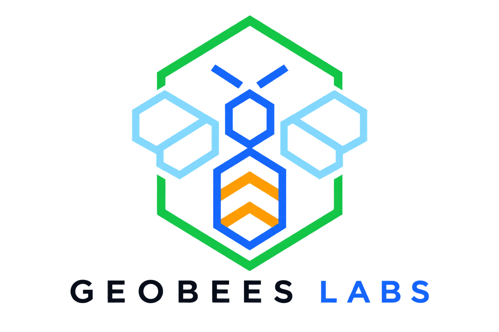

# V-Keyframe

<picture>
  <source media="(prefers-color-scheme: dark)" srcset="./branding/geobees-labs-logo_1.png">
  <source media="(prefers-color-scheme: light)" srcset="./branding/geobees-labs-logo_1.png">
  
</picture>

**Turn any video into an archive of the moments worth keeping.**

`v1.0` · Open source · MIT License

V-Keyframe is a single-file, browser-based tool that watches a video for still frames — diagram cards, slides, static panels — and captures each one automatically. No installs, no accounts, no server: everything runs entirely on your own device.

> Built by Geobees Labs, and given to the community as free and open-source software. Local & offline by design.

---

## Why

Educational and technical videos often pack real information into static cards that sit on screen for a few seconds and then are gone. Capturing them today usually means pausing, screenshotting, cropping, and renaming — one frame at a time, for the entire length of the video.

V-Keyframe automates that: drop in a video, and it finds every "held" frame for you.

## How it works

1. **Drop a video** — loaded locally via the browser's File API. The file is never uploaded anywhere.
2. **Sample the frame** — checked at a configurable interval against the last sample.
3. **Detect stillness** — a frame only counts once it has held steady for long enough, so mid-transition frames are never captured.
4. **Capture the card** — new frames are compared against everything already found, so the same card is never captured twice.
5. **Export** — as individual images, a single PDF, or written directly to a folder on disk.

Three sliders tune the detector to fit the video:

| Control | Range | What it does |
|---|---|---|
| **Sample rate** | 0.2s – 2s | How often the frame is checked. Lower catches quick cuts; higher processes faster. |
| **Hold time** | 0.4s – 3s | How long a frame must stay visually unchanged before it counts as a settled card. |
| **Sensitivity** | very low – very high | How different a new frame must look (via a downsampled pixel-diff) to count as genuinely new content. |

## Features

- **Tunable automatic detection** — sample rate, hold time, and sensitivity adapt to any pacing, from slow lecture slides to fast-cut tutorials.
- **Frame filters** — optionally skip near-blank/solid-color frames (fades, transitions), or restrict capture to single-toned frames (true grayscale, sepia, cyanotype, chalkboard-blue — anything dominated by one hue, regardless of how saturated it is).
- **Manual capture** — scrub the video with native playback controls and grab any frame the automatic scan misses.
- **On-device OCR** — each card's text is read locally (via Tesseract.js) and saved alongside the image, with no server round-trip.
- **Batch / queue mode** — drop several videos at once; each is scanned in turn automatically, with cards tagged by source video.
- **Direct-to-folder export** — using the File System Access API, cards are written straight to a chosen folder as they're found. No zip step, no waiting at the end. (Chromium-based browsers only; other browsers fall back to a zip download.)
- **Three image formats** — PNG (lossless), JPEG, or WebP, each with a live compression comparison so you can see the size trade-off before exporting.
- **Configurable file naming** — number only, timecode only, or both, so exported files always correlate back to their moment in the source video.
- **Single-document PDF export** — the whole collection as one PDF, with a caption and OCR text under every image, and an optional "fit to page" mode for a uniform, print-ready layout.
- **Resumable sessions** — captured cards persist locally via IndexedDB. An accidental refresh or closed tab doesn't lose the work; reopen the page and choose to restore or discard.

## Getting started

No installation, no build step, no dependencies to manage.

1. Download `v-keyframe.html` (or clone this repo).
2. Open the file directly in a modern browser (Chrome, Edge, or another Chromium-based browser is recommended for full functionality, including direct-to-folder export).
3. Drop in a video, or queue several at once.
4. Adjust the detection sliders if needed, and press **Start scanning**.
5. Export as a folder, a zip, or a single PDF.

## Architecture

The entire app is one HTML file. Video decoding, frame sampling, image encoding, OCR, and PDF generation all happen with standard browser APIs:

| Technology | Used for |
|---|---|
| Canvas API | Frame sampling and pixel-diff comparison |
| File System Access API | Direct-to-folder writes |
| IndexedDB | Local session persistence |
| [Tesseract.js](https://github.com/naptha/tesseract.js) | On-device OCR |
| [JSZip](https://github.com/Stuk/jszip) | Zip archive export |
| [jsPDF](https://github.com/parallax/jsPDF) | Single-document PDF export |

The only external network requests the page makes are for the three CDN-loaded libraries above — the video file itself is never transmitted anywhere.

## Privacy

Nothing to configure, nothing to trust: there is simply no network call in the capture pipeline for a video file to travel through. Everything — decoding, detection, OCR, and export — happens locally in your browser.

## Browser support

Core capture, OCR, and export (zip / PDF) work in any modern browser. Direct-to-folder writing requires the File System Access API, currently supported in Chromium-based browsers (Chrome, Edge, Brave, etc.); other browsers automatically fall back to the zip download.

## Branding

The `branding/` folder includes the Geobees Labs logo in a few forms:

| File | Use |
|---|---|
| `geobees-labs-logo.png` | Full logo (icon + wordmark), transparent background — for light backgrounds (this README, docs) |
| `geobees-labs-logo-on-dark.png` | Full logo, flattened onto the app's dark background color — for dark-mode contexts or a GitHub social preview image |
| `geobees-labs-icon.png` | Icon mark only, transparent background — for favicons, avatars, or anywhere the wordmark would be too small to read |

## Contributing

This project is open source and welcomes contributions from anyone. Issues, feature requests, and pull requests are all appreciated. Since the entire app lives in a single HTML file, there's no build step to set up — clone the repo, edit the file, and open it in a browser to test your changes.

## License

Released under the [MIT License](LICENSE) — free to use, modify, and distribute, for personal or commercial projects, with attribution.
